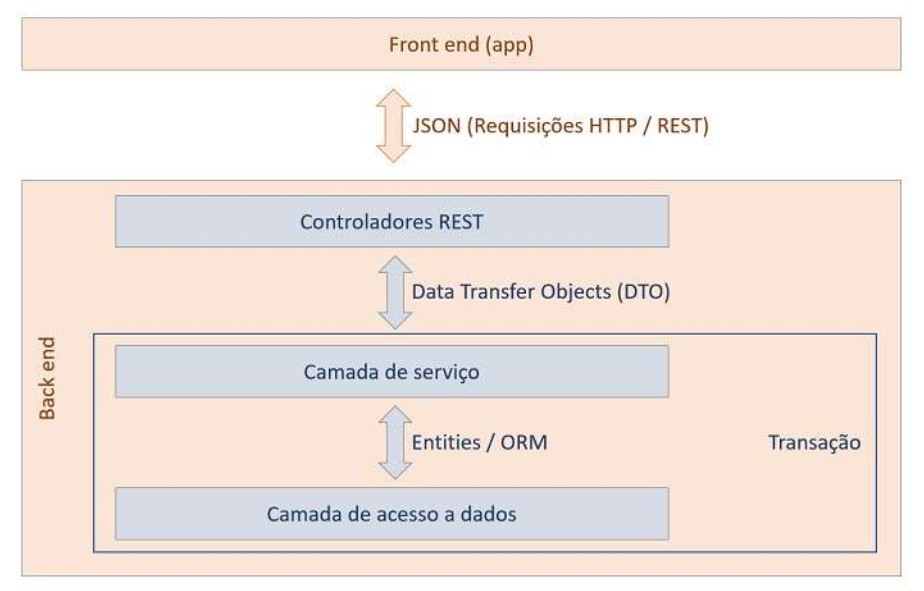

#  Lazy & Eager loading

### Eager loading:
O carregamento Eager inicializa o recurso no momento em que a entidade é carregada do banco de dados. 
Todos os dados são carregados, incluindo a inicialização dos recursos associados, independente 
se serão de fato usados ou não. 
* Isso pode gerar sobrecarga, caso existam muitas associações ou dados relacionados.

### Lazy loading:
Adia o carregamento dos dados associados até que sejam **explicitamente** acessados no 
código. Dessa forma a aplicação não fica sobrecarregada com dados que não são pertinentes ao contexto.
* Dependendo do fluxo da aplicação, o carregamento lazy pode gerar degradação de performance, especialmente
no caso onde muitas entidades associadas são acessadas individualmente, gerando várias consultas ao
banco de dados - um problema conhecido como **N+1 Select Problem**.

***

No caso de entidades associadas, ***<ins>usando Spring Data JPA + Hibernate*** o comportamento é o seguinte:

>**Relacionamento para-um (@ManyToOne, @OneToOne)**
>
> Quando uma entidade *X(@ManyToOne)* consultada possui um relacionamento -1 com outra entidade *Y(@OneToMany)*, 
> ou seja, cada entidade *X* está associada a UMA outra entidade *Y*, o carregamento é do
> tipo **<ins>Lazy**.
>
> 
> * **IMPORTANTE**: O padrão do Hibernate para carregamentos ManyToOne é o **LAZY**. Porém, na conversão
> do resultado da consulta para JSON pelo Spring o mecanismo de serialização, força o proxy Lazy a inicializar 
> e o Hibernate faz o carregamento da entidade associada Y. 
> É necessário considerar outros processos realizados pelo Spring que podem ocasionar esse comportamento.

>**Relacionamento para-muitos**
>
> Quando uma entidade *X(@OneToMany)* consultada possui um relacionamento -n com outra entidade *Y(@ManyToOne)*, 
> ou seja, cada entidade *X* está associada a VÁRIAS outras entidades *Y*, o carregamento por padrão é do
> tipo **<ins>Lazy**.
> 
> Carregar X vai carregar apenas X. Outros recursos e entidades relacionadas a X só serão recuperados
> do banco de dados e carregados quando **explicitamente chamados no código**.

***
### @Transactional
No Spring a annotation @Transactional define que **um método ou classe deve ser executado dentro de uma
transação**.
>- **Transação** é um conjunto de operações que devem ser executadas de forma atômica, consistente, isolada e
>durável - os princípios ACID:
>   - **1. (A)tomicidade**: todas as operações devem ser conluídas com sucesso, ou nenhuma será (rollback);
>   - **2. (C)onsistência**: o banco de dados deve sair de um estado válido para outro estado válido após
>   a transação;
>   - **3. (I)solamento**: uma transação não interfere em outra;
>   - **4. (D)urabilidade**: após a transação bem sucedida (commit), os dados são permanentes.

@Transactional assegura que, a sessão JPA (EntityManager) permaneça ativa durante a execução do método. Isso
permite que o JPA faça o carregamento de todas as associações "Lazy" caso seja requisitado. 
 Se houver uma tentativa de carregar associações desse tipo fora da transação, a sessão JPA estará fechada e
o carregamento vai falhar (LazyInitializationException).

Esse comportamento é chamado **<ins>Open Session in View** e pode ser configurado dentro do arquivo **application.properties**.

Abaixo o modelo de arquitetura em 3 camadas define o escopo da transação: a camada Controller está fora
da transação (open-in-view=false), isso significa a sessão JPA está inativa nesse escopo, portanto qualquer tentativa 
de carregamento de recursos lazy nessa camada vai resultar em LazyInitializationException.

    

    

